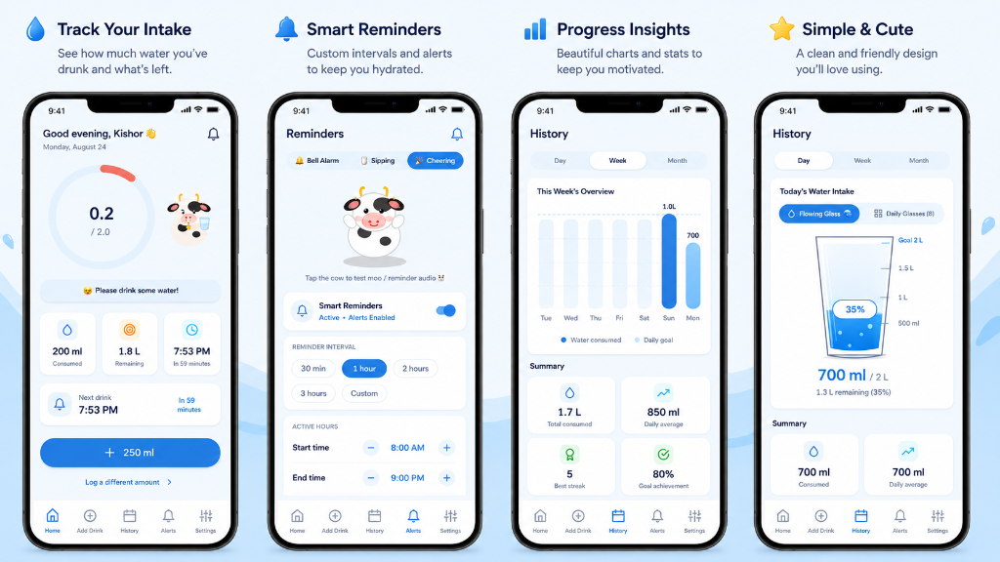
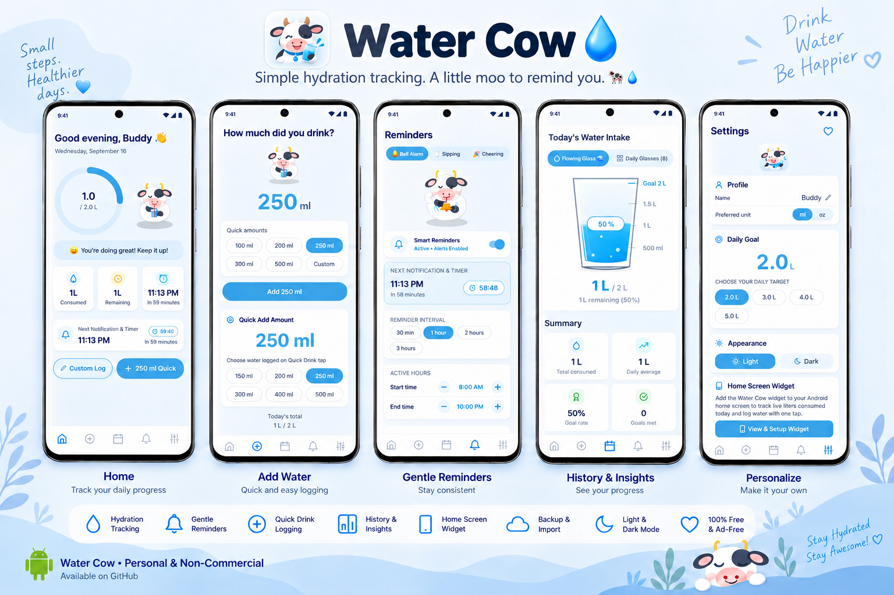

# 🐮 Water Cow — Hydration Reminder App

Water Cow is a feature-packed React Native & Expo mobile application for tracking daily water intake, managing reminders, playing custom notification sounds, and syncing hydration progress with an Android home screen widget.


## 🔗 Quick Links

- 🌐 **Official Website**: [https://water-cow.vercel.app/](https://water-cow.vercel.app/)
- 📚 **Documentation**: [https://water-cow-doc.vercel.app/docs/intro](https://water-cow-doc.vercel.app/docs/intro)
- 📦 **Download APK**: [GitHub Release (v1.0.0)](https://github.com/kishor-23/Water-Cow/releases/download/v1.0.0/watercow.apk)

---

## 📱 App Showcase

| App Features Showcase | Phone Screenshot |
| :---: | :---: |
|  |  |

---

## ✨ Key Features

- **Hydration Tracking**: Log custom or quick-add water volumes (+250ml, +500ml).
- **Interactive Cow Mascot**: Expressive SVG mascot whose mood changes based on daily progress.
- **Custom Notification Sounds**: Play custom moo and water sounds on periodic reminders.
- **Native Android Home Screen Widget**: Live update widget with direct quick-add action.
- **JSON Backup & Restore**: Export and import full hydration history.
- **Light / Dark Theme**: Supports system, light, and dark mode styling.

---

## 📖 Developer Documentation

Complete documentation is built using Docusaurus and deployed live at [https://water-cow-doc.vercel.app/docs/intro](https://water-cow-doc.vercel.app/docs/intro).

### Running the Documentation Site Locally

```bash
# Start local docs dev server
npm run docs

# Build static documentation site
npm run docs:build
```

### Documentation Structure

- [Getting Started](documentation-site/docs/getting-started/installation.md): Installation & setup.
- [Architecture](documentation-site/docs/architecture/overview.md): System architecture, state management, and data flow.
- [Features](documentation-site/docs/features/water-tracking.md): Detailed breakdown of all app features.
- [React Native](documentation-site/docs/react-native/concepts.md): Components, custom hooks, and state context.
- [Android Native](documentation-site/docs/android/overview.md): Kotlin native modules, AppWidgetProvider, and Gradle setup.
- [Expo](documentation-site/docs/expo/overview.md): Expo SDK 57, prebuild system, and EAS build profiles.
- [Development](documentation-site/docs/development/adding-features.md): How-to guides, command reference, and debugging.
- [Troubleshooting](documentation-site/docs/troubleshooting/build-errors.md): Resolution steps for build, widget, and notification issues.

---

## 🛠️ Tech Stack

- **Frontend**: React Native, Expo SDK 57, TypeScript, React Context, `expo-router`
- **Native Android**: Kotlin, Android AppWidgetProvider, SharedPreferences, Custom Android Notification Channels
- **Documentation**: Docusaurus 3, Mermaid.js
