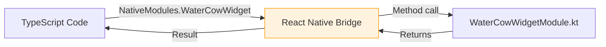

# Android Native Layer

Water Cow is primarily a React Native app, but certain features require native Android code written in Kotlin.

## Why Native Code?

Some features cannot be implemented in JavaScript because they need direct access to Android APIs:

| Feature | Why Native? |
|---------|------------|
| Home screen widget | Uses `RemoteViews`, runs in the launcher's process |
| Custom notification sounds | Requires native `Uri` references to `res/raw/` files |
| Notification channels | Best created natively for full control over sound and settings |

## Native Files

All Kotlin files live in `android/app/src/main/java/com/watercow/app/`:

| File | Purpose | Lines |
|------|---------|-------|
| `MainActivity.kt` | Standard Expo/RN activity | ~10 |
| `MainApplication.kt` | App entry point, registers native packages | ~30 |
| `WaterCowWidgetProvider.kt` | Widget logic (AppWidgetProvider) | ~120 |
| `WaterCowWidgetModule.kt` | JS ↔ Kotlin bridge (NativeModule) | ~45 |
| `WaterCowWidgetHelper.kt` | SharedPreferences helper | ~30 |
| `WaterCowWidgetPackage.kt` | Registers native modules with RN | ~20 |
| `WaterCowNotificationModule.kt` | Notification channel creation | ~50 |

## How JS Calls Native Code



In TypeScript:
```typescript
import { NativeModules } from 'react-native';
const { WaterCowWidget } = NativeModules;
await WaterCowWidget.updateWidget(1500, 2000);
```

In Kotlin:
```kotlin
@ReactMethod
fun updateWidget(consumedMl: Int, goalMl: Int) {
    // Write to SharedPreferences
    // Trigger widget update
}
```

The connection is made through `WaterCowWidgetPackage.kt`, which is registered in `MainApplication.kt`.

## Build Configuration

See [Gradle](/docs/android/gradle) for details on the build system.

## Android Manifest

`AndroidManifest.xml` declares:
- App permissions (`POST_NOTIFICATIONS`, `SCHEDULE_EXACT_ALARM`, `RECEIVE_BOOT_COMPLETED`)
- The main activity
- The widget receiver and its intent filters
- The deep link URL scheme (`watercow://`)
