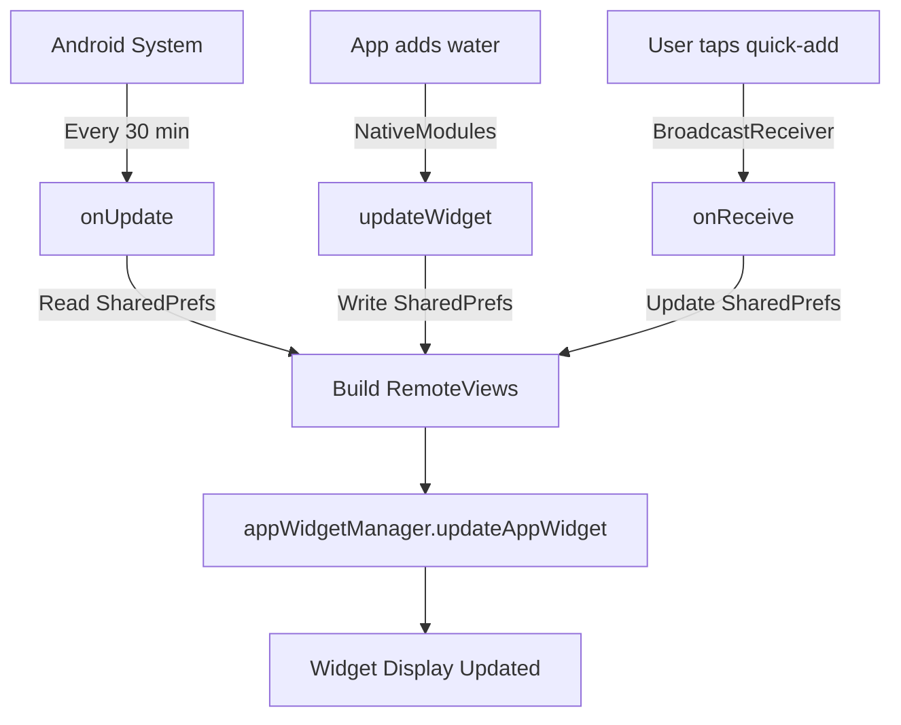

# Android Widget Deep Dive

This page covers the widget from the **Android perspective** — the XML layouts, manifest registration, and Android OS integration. For the React Native integration, see [Widget Feature](/docs/features/widget).

## Widget XML Layout (`res/layout/watercow_widget.xml`)

The widget uses a `RelativeLayout` with:

```
┌──────────────────────────────┐
│ Water Cow 🐄          Today  │  ← Header (LinearLayout, horizontal)
│                              │
│ 1.5 L                       │  ← Big liters text (32sp, sky blue)
│ of 2.0 L Goal (75%)         │  ← Goal subtitle (12sp)
│                              │
│ ████████████░░░░             │  ← Progress bar (horizontal)
└──────────────────────────────┘
```

### Widget Background (`res/drawable/widget_bg.xml`)

A rounded rectangle with a dark gradient:

```xml
<shape android:shape="rectangle">
    <gradient
        android:startColor="#1A2332"
        android:endColor="#0F1923"
        android:angle="135"/>
    <corners android:radius="20dp"/>
</shape>
```

### Widget Progress Bar (`res/drawable/widget_progress_bar.xml`)

Custom drawable with a gradient progress fill.

## Widget Metadata (`res/xml/watercow_widget_info.xml`)

```xml
<appwidget-provider
    android:minWidth="180dp"
    android:minHeight="80dp"
    android:targetCellWidth="3"
    android:targetCellHeight="2"
    android:updatePeriodMillis="1800000"
    android:initialLayout="@layout/watercow_widget"
    android:previewLayout="@layout/widget_preview"
    android:resizeMode="horizontal|vertical"
    android:widgetCategory="home_screen" />
```

| Attribute | Value | Description |
|-----------|-------|-------------|
| `minWidth` | 180dp | Minimum 3 cells wide |
| `minHeight` | 80dp | Minimum 2 cells tall |
| `updatePeriodMillis` | 1800000 | System triggers `onUpdate()` every 30 minutes |
| `resizeMode` | horizontal\|vertical | User can resize the widget |
| `widgetCategory` | home_screen | Only appears on the home screen (not lock screen) |

## AndroidManifest Registration

```xml
<receiver
    android:name=".WaterCowWidgetProvider"
    android:exported="true">
    <intent-filter>
        <action android:name="android.appwidget.action.APPWIDGET_UPDATE"/>
        <action android:name="com.watercow.app.ACTION_QUICK_ADD_WATER"/>
    </intent-filter>
    <meta-data
        android:name="android.appwidget.provider"
        android:resource="@xml/watercow_widget_info"/>
</receiver>
```

The receiver listens for:
- `APPWIDGET_UPDATE` — Standard widget update signal from Android
- `ACTION_QUICK_ADD_WATER` — Custom action for the quick-add button

## Widget Update Lifecycle



## RemoteViews Limitations

Android home screen widgets use `RemoteViews`, which has significant limitations compared to regular Android views:

| Feature | RemoteViews Support |
|---------|-------------------|
| `TextView` | ✅ Yes |
| `ImageView` | ✅ Yes |
| `ProgressBar` | ✅ Yes |
| `LinearLayout` | ✅ Yes |
| `RelativeLayout` | ✅ Yes |
| `RecyclerView` | ❌ No (use `ListView`) |
| Custom views | ❌ No |
| Animations | ❌ No |
| Touch events (drag, etc.) | ❌ No (only click) |

This is why the widget is static text + a progress bar, not a fancy animated cow.
