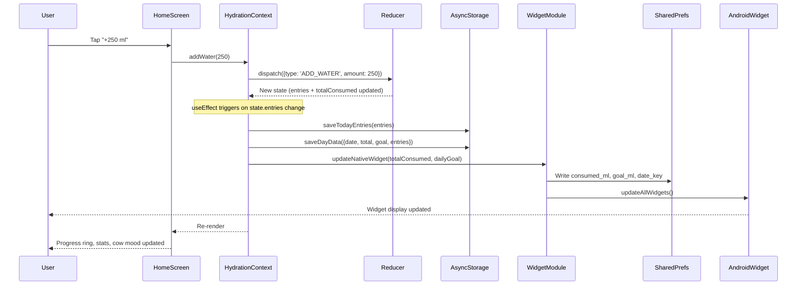
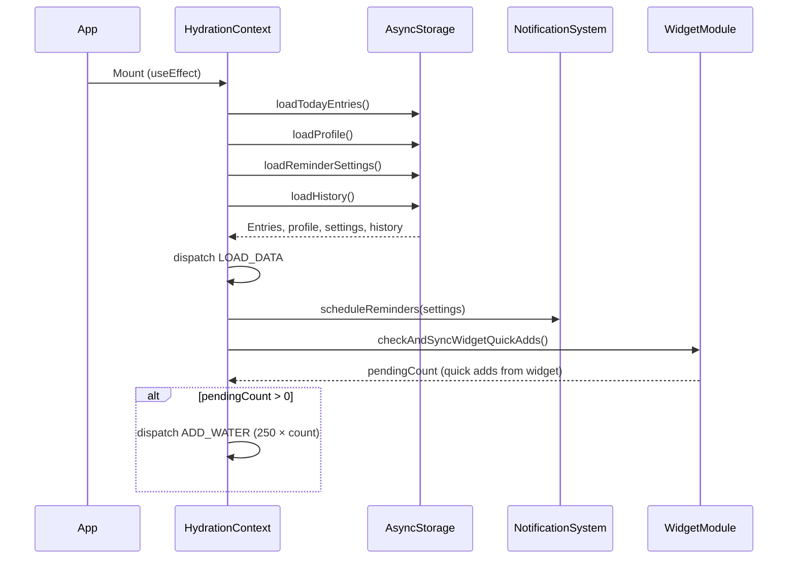
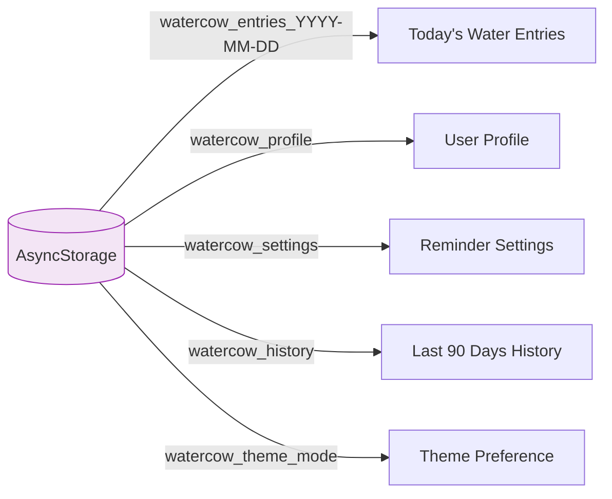
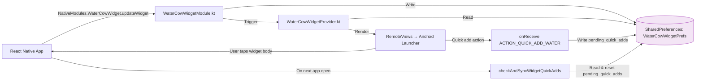

# Data Flow

This page explains how data moves through the Water Cow app when a user performs common actions.

## Adding Water

The most frequent user action — tapping "+250 ml" on the home screen.

## App Startup

When the app launches, it loads all persisted data and syncs any pending widget quick-adds.

## Storage Structure

All data is stored as JSON strings in AsyncStorage with these keys:

| Key Pattern | Value | Example |
|------------|-------|---------|
| `watercow_entries_2026-09-14` | `WaterEntry[]` | `[{id, amount: 250, timestamp}]` |
| `watercow_profile` | `UserProfile` | `{name: "Buddy", unit: "ml", dailyGoal: 2000}` |
| `watercow_settings` | `ReminderSettings` | `{enabled: true, intervalMinutes: 60, sound: "cow_moo", ...}` |
| `watercow_history` | `DayData[]` | Last 90 days, sorted newest first |
| `watercow_theme_mode` | `string` | `"system"`, `"light"`, or `"dark"` |

## Widget Data Sync

The React Native app and the native Android widget share data through **Android SharedPreferences**, not AsyncStorage.

### SharedPreferences Keys (Widget)

| Key | Type | Description |
|-----|------|-------------|
| `consumed_ml` | `Int` | Milliliters consumed today |
| `goal_ml` | `Int` | Daily goal in milliliters (default: 2000) |
| `date_key` | `String` | Today's date (`YYYY-MM-DD`) — resets consumption on new day |
| `pending_quick_adds` | `Int` | Number of quick-add taps from widget awaiting sync |
