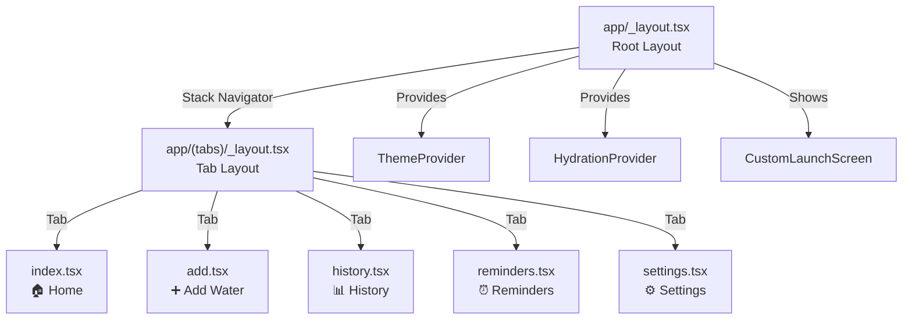

# Navigation

Water Cow uses **expo-router** for file-based routing. The file structure in the `app/` directory directly defines the app's navigation structure.

## How File-Based Routing Works

Every `.tsx` file inside `app/` becomes a route:

| File | Route | Screen |
|------|-------|--------|
| `app/(tabs)/index.tsx` | `/` | Home (default tab) |
| `app/(tabs)/add.tsx` | `/add` | Add Water |
| `app/(tabs)/history.tsx` | `/history` | History & Charts |
| `app/(tabs)/reminders.tsx` | `/reminders` | Reminder Settings |
| `app/(tabs)/settings.tsx` | `/settings` | App Settings |

### Special Files

| File | Purpose |
|------|---------|
| `_layout.tsx` | Defines the navigation structure for its directory |
| `+html.tsx` | Custom HTML wrapper for web builds |

## Navigation Structure



## Root Layout (`app/_layout.tsx`)

The root layout handles:
1. **Font loading** — Loads the Inter font family (5 weights) using `@expo-google-fonts/inter`
2. **Splash screen** — Shows until fonts are loaded, then transitions to a custom animated launch screen
3. **Providers** — Wraps the entire app in `ThemeProvider` and `HydrationProvider`
4. **Stack navigator** — A single-screen stack containing the tab navigator

## Tab Layout (`app/(tabs)/_layout.tsx`)

The tab layout configures the **bottom tab bar** with:
- 5 tabs using Feather icons from `@expo/vector-icons`
- No text labels (icons only)
- Dynamic colors from the active theme
- Frosted glass effect on the tab bar background

| Tab | Icon | Component |
|-----|------|-----------|
| Home | `home` | `index.tsx` |
| Add Water | `plus-circle` | `add.tsx` |
| History | `calendar` | `history.tsx` |
| Reminders | `bell` | `reminders.tsx` |
| Settings | `sliders` | `settings.tsx` |

## Programmatic Navigation

Screens can navigate programmatically using the `useRouter` hook:

```typescript
import { useRouter } from 'expo-router';

function HomeScreen() {
  const router = useRouter();

  // Navigate to a tab
  router.push('/settings');
  router.push('/add');
}
```

## Deep Linking

The app registers the `watercow://` URL scheme (configured in `app.json`). This means:
- Opening `watercow://` on the device launches the app
- The widget uses this to open the app when tapped

```xml
<!-- In AndroidManifest.xml -->
<intent-filter>
  <action android:name="android.intent.action.VIEW"/>
  <category android:name="android.intent.category.DEFAULT"/>
  <category android:name="android.intent.category.BROWSABLE"/>
  <data android:scheme="watercow"/>
</intent-filter>
```
