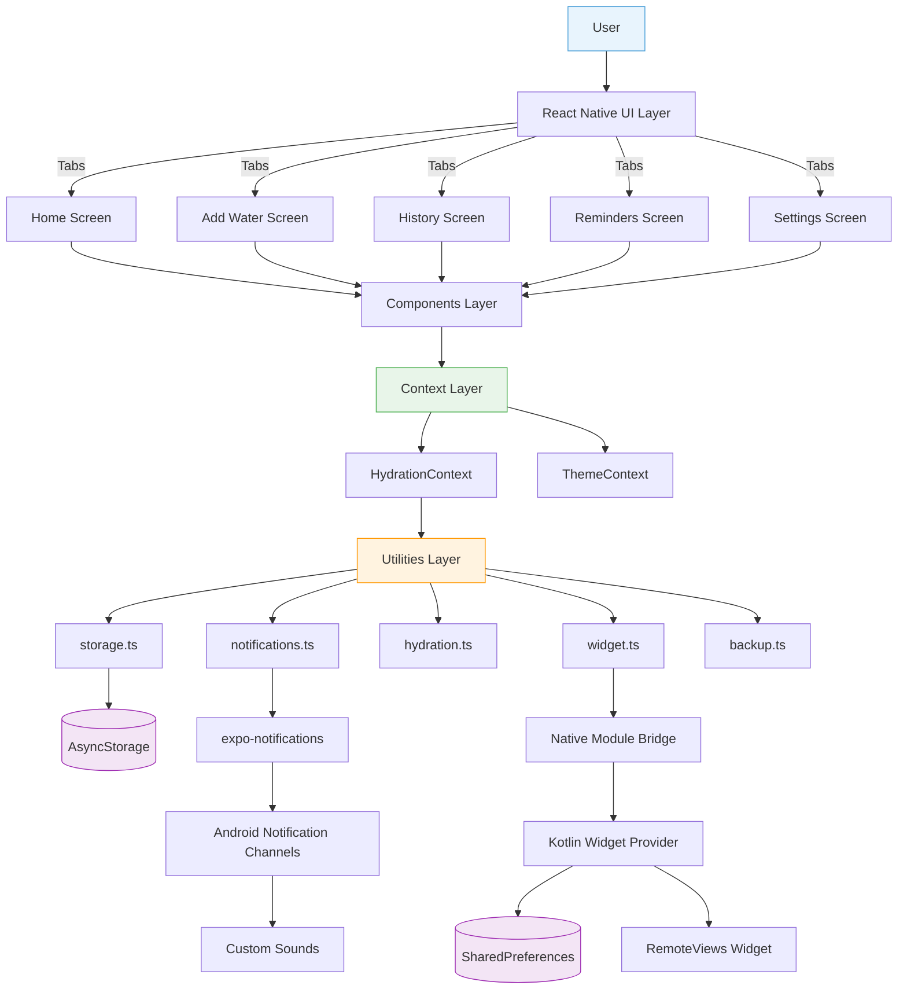
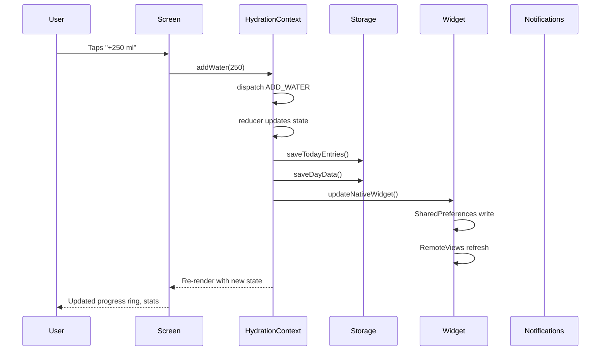

# Architecture Overview

Water Cow follows a layered architecture where data flows from user interactions down through a context layer to storage and native APIs, and back up to the UI.

## High-Level Architecture

## Layer Descriptions

### 1. UI Layer (`app/`)

The screens that the user sees and interacts with. Uses **expo-router** file-based routing with a tab navigator (bottom tab bar with 5 tabs).

### 2. Components Layer (`components/`)

Reusable UI building blocks used across screens. Split into:
- **`cow/`** — Cow mascot SVG rendering and animations
- **`ui/`** — General purpose components (cards, progress ring, charts, buttons)

### 3. Context Layer (`context/`)

Global state management using React's **Context + useReducer** pattern. Two providers wrap the entire app:
- **HydrationContext** — All water tracking state, actions, and derived values
- **ThemeContext** — Light/dark mode preference and active color scheme

### 4. Utilities Layer (`utils/`)

Pure business logic and platform integration functions. No UI code. Five modules:
- **storage.ts** — AsyncStorage read/write operations
- **notifications.ts** — Notification channel management and scheduling
- **hydration.ts** — Date formatting, progress calculation, time helpers
- **widget.ts** — Native Android widget bridge
- **backup.ts** — Export/import JSON backups

### 5. Constants (`constants/`)

Static configuration values and design tokens:
- **theme.ts** — Color palette, typography, spacing, shadows (light + dark)
- **cowMoods.ts** — Cow mood calculation algorithm and mood definitions

### 6. Native Layer (`android/`)

Kotlin code that handles features React Native cannot do directly:
- **Widget** — `AppWidgetProvider` + `RemoteViews` for the Android home screen widget
- **Notification Module** — Native module for creating notification channels with custom sounds
- **Native Module Bridge** — `ReactPackage` that registers the native modules with React Native

## Data Flow

## Key Design Patterns

| Pattern | Where | Why |
|---------|-------|-----|
| **Context + useReducer** | `HydrationContext.tsx` | Centralized state with predictable updates, like a mini-Redux |
| **Unidirectional data flow** | Everywhere | Actions → reducer → state → UI. No two-way binding. |
| **Side effects in useEffect** | `HydrationContext.tsx` | Persistence and widget updates happen as reactions to state changes |
| **Native Module bridge** | `widget.ts` ↔ `WaterCowWidgetModule.kt` | JS calls Kotlin via React Native's NativeModules |
| **SharedPreferences sync** | Widget system | React Native and native widget share data via Android SharedPreferences |
