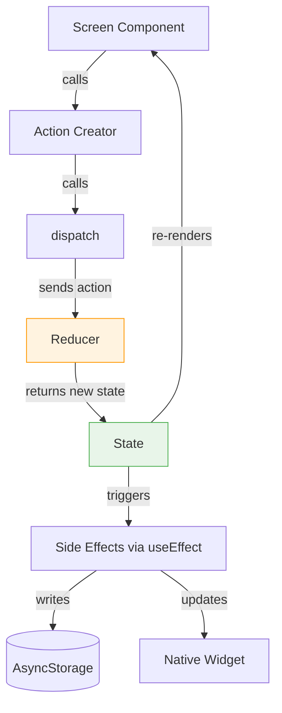

# State Management

Water Cow uses React's built-in **Context + useReducer** pattern for global state. There is no Redux, Zustand, MobX, or any third-party state management library.

## Why Context + useReducer?

For a single-purpose app with a small state surface, Context + useReducer provides:
- **Zero additional dependencies**
- **Predictable updates** via a reducer (pure function)
- **Central dispatch** — all state changes go through one place
- **Built-in** to React — no learning curve for React developers

## Architecture



## The State Shape

Defined in `context/HydrationContext.tsx`:

```typescript
interface HydrationState {
  entries: WaterEntry[];       // Today's water entries
  totalConsumed: number;       // Sum of all entries (ml)
  profile: UserProfile;        // Name, unit (ml/oz), daily goal
  reminderSettings: ReminderSettings;  // Reminder schedule config
  history: DayData[];          // Last 90 days of daily summaries
  isLoading: boolean;          // True during initial data load
  lastDrinkTime: number;       // Timestamp of most recent entry
  showSuccess: boolean;        // Flash success animation after adding water
}
```

## Actions

| Action Type | Payload | Effect |
|------------|---------|--------|
| `LOAD_DATA` | entries, profile, settings, history | Initializes all state from storage |
| `ADD_WATER` | amount (number) | Creates a new entry, updates total |
| `DELETE_ENTRY` | id, dateKey? | Removes an entry from today or history |
| `UPDATE_HISTORY` | history | Replaces the history array |
| `SET_GOAL` | goal (number) | Updates daily goal |
| `UPDATE_PROFILE` | Partial\<UserProfile\> | Merges profile changes |
| `UPDATE_REMINDERS` | ReminderSettings | Updates reminder configuration |
| `HIDE_SUCCESS` | — | Clears the success animation flag |
| `RESET_DAY` | — | Clears today's entries and total |

## Derived Values

The context also exposes **computed values** that aren't stored in state but derived from it:

```typescript
// Progress: 0 to 1 ratio of consumed vs goal
const progress = Math.min(totalConsumed / dailyGoal, 1);

// Cow mood: calculated from progress + time since last drink
const cowMood = calculateCowMood(totalConsumed, dailyGoal, minutesSinceLastDrink, intervalMinutes);
```

These are recalculated on every render — no caching needed because the computation is trivial.

## Side Effects

The `HydrationProvider` component uses `useEffect` to persist state changes:

```typescript
// When entries change → save to AsyncStorage + update widget
useEffect(() => {
  if (!state.isLoading) {
    saveTodayEntries(state.entries);
    saveDayData({ date, totalConsumed, goal, entries });
    updateNativeWidget(totalConsumed, dailyGoal);
  }
}, [state.entries, state.totalConsumed, state.isLoading, state.profile.dailyGoal]);
```

This pattern means:
1. User taps a button → dispatches an action
2. Reducer updates state (synchronous, pure)
3. Component re-renders with new state
4. useEffect fires → persists to storage and updates widget (asynchronous)

## Theme State

Theme is managed separately in `context/ThemeContext.tsx` using `useState` (simpler because there's only one piece of state):

```typescript
// State: 'system' | 'light' | 'dark'
const [themeMode, setThemeModeState] = useState<ThemeMode>('system');

// Derived: actual colors based on mode + system preference
const isDark = themeMode === 'system' ? systemColorScheme === 'dark' : themeMode === 'dark';
const colors = isDark ? DarkColors : Colors;
```

## Accessing State in Components

Any component can access the global state using the custom hooks:

```typescript
import { useHydration } from '../context/HydrationContext';
import { useTheme } from '../constants/theme';

function MyComponent() {
  const { state, addWater, progress, cowMood } = useHydration();
  const { colors, isDark } = useTheme();
  // ...
}
```

:::warning Provider Requirement
`useHydration()` throws an error if used outside of `<HydrationProvider>`. Both providers are set up in `app/_layout.tsx` (root layout), so all screens and components have access.
:::
