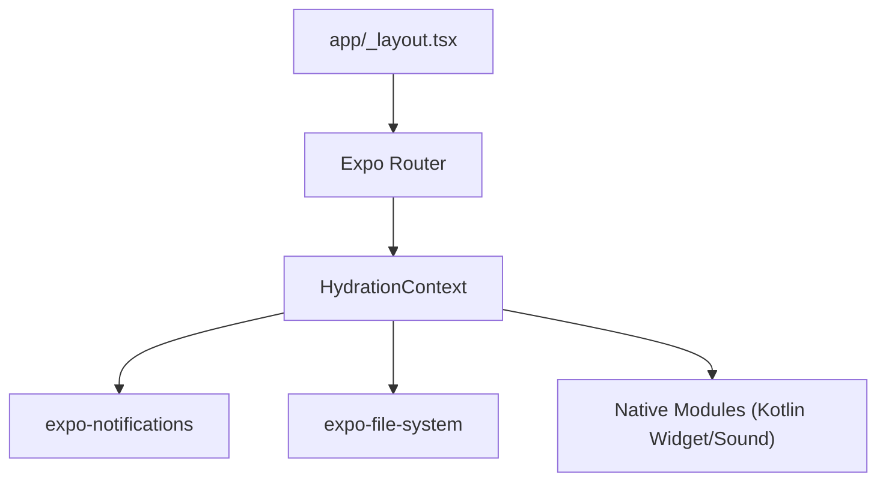

# Expo Overview

**Expo** is a framework and platform for React Native applications that provides a set of tools, libraries, and services to simplify mobile development.

## What is Expo?

In plain React Native, you need to manage native iOS (`ios/`) and Android (`android/`) directories manually, configure native build tools (Xcode and Android Studio), and write native bridge code for platform features.

Expo wraps React Native and provides:
- **Managed workflow & Config Plugins**: Automatic generation and configuration of native projects (`npx expo prebuild`).
- **Expo SDK**: Standardized cross-platform APIs for camera, notifications, filesystem, location, state persistence, sound, and more.
- **Expo Router**: File-based routing for React Native (similar to Next.js).
- **Development Builds**: Custom build binaries (`expo-dev-client`) that include any custom native modules while preserving hot reloading.

## Expo Version in Water Cow

Water Cow runs on Expo SDK in `package.json`.

Key Expo SDK packages used in this app:
- `expo-router`: Navigation and file-based routing.
- `expo-notifications`: Local notification scheduling and handling.
- `expo-av`: Custom notification sound playback (previewing in settings).
- `expo-file-system`: Reading/writing backup JSON files.
- `expo-sharing`: Sharing JSON backup files via system share dialog.
- `expo-document-picker`: Importing backup JSON files.
- `expo-status-bar`: Translucent/themed system status bar styling.
- `expo-font`: Loading custom fonts.
- `expo-splash-screen`: Splash screen presentation during startup state load.

## Expo Architecture Flow

