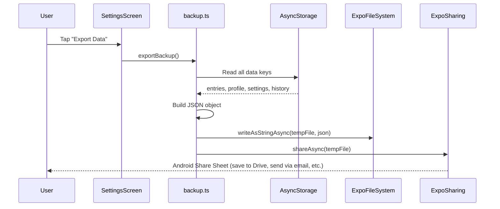
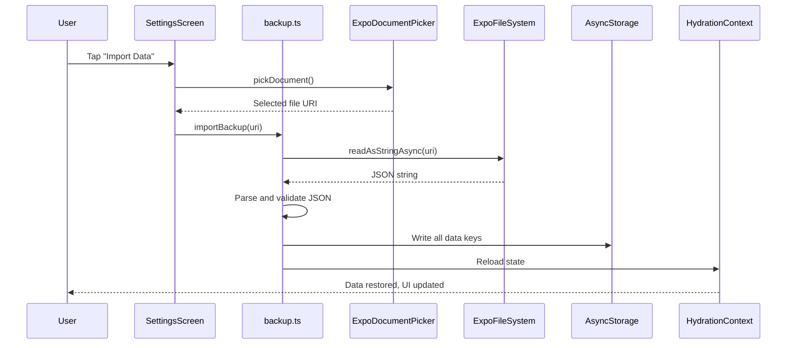

# Backup & Restore

Water Cow allows users to export all their data as a JSON file and import it back later.

## Export Flow



## Import Flow



## Backup File Format

The exported JSON file contains:

```json
{
  "version": 1,
  "exportDate": "2026-09-14T08:00:00.000Z",
  "profile": {
    "name": "Buddy",
    "unit": "ml",
    "dailyGoal": 2000
  },
  "reminderSettings": {
    "enabled": true,
    "intervalMinutes": 60,
    "startHour": 8,
    "startMinute": 0,
    "endHour": 22,
    "endMinute": 0,
    "sound": "cow_moo",
    "vibrate": true
  },
  "history": [
    {
      "date": "2026-09-14",
      "totalConsumed": 1750,
      "dailyGoal": 2000,
      "entries": [
        { "id": "abc123", "amount": 250, "timestamp": 1726300800000 }
      ]
    }
  ]
}
```

## Dependencies Used

| Package | Purpose |
|---------|---------|
| `expo-file-system` | Write the JSON backup to a temporary file |
| `expo-sharing` | Open the Android Share Sheet to save/send the file |
| `expo-document-picker` | Open a file picker to select a backup file for import |

## Validation

On import, the backup module validates:
- The file is valid JSON
- The `version` field exists
- Required fields (`profile`, `reminderSettings`, `history`) are present
- Data types are correct (numbers are numbers, strings are strings)

Invalid files show an error message to the user.
