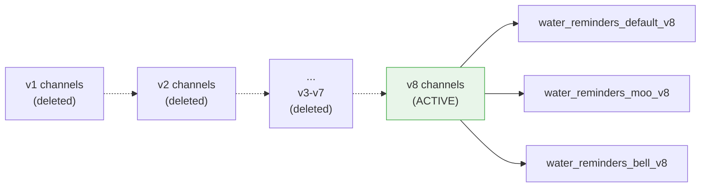

# Notification Sounds (Channel Versioning)

This is one of the most complex parts of Water Cow. Understanding the **Android notification channel caching problem** is critical for anyone maintaining the notification system.

## The Problem

Android **permanently caches** notification channel settings once a channel is created. This means:

1. You create channel `water_reminders_moo` with sound `cow_moo.mp3`
2. The user hears `cow_moo.mp3` ✅
3. You want to change the sound to `cow_bell.mp3`
4. You call `createNotificationChannel("water_reminders_moo", ...)` with the new sound
5. **Android ignores the update** — the original sound is still cached ❌

There is **no API** to programmatically update a channel's sound after creation. The only solutions are:
- Ask the user to manually delete the channel in Android Settings
- Create a **new channel** with a different ID

## The Solution: Channel Versioning

Water Cow uses a version suffix in channel IDs:

```typescript
const CHANNEL_VERSION = 'v8';  // Increment when channels need recreation

// Channel IDs
const CHANNEL_DEFAULT = `water_reminders_default_${CHANNEL_VERSION}`;
const CHANNEL_MOO     = `water_reminders_moo_${CHANNEL_VERSION}`;
const CHANNEL_BELL    = `water_reminders_bell_${CHANNEL_VERSION}`;
```

When a notification setting changes and old channels need to be replaced:
1. Increment `CHANNEL_VERSION` (e.g., `v8` → `v9`)
2. Create new channels with the new version suffix
3. Delete the old channels



## Old Channel Cleanup

The app proactively cleans up old channel IDs on startup:

```typescript
const OLD_CHANNEL_IDS = [
  // v1
  'water_reminders_default', 'water_reminders_cowmoo', 'water_reminders_cowbell',
  // v2
  'water_reminders_moo_v2', 'water_reminders_bell_v2', 'water_reminders_default_v2',
  // v3 through v7...
  // (24 total old channel IDs)
];

async function cleanupOldChannels() {
  for (const channelId of OLD_CHANNEL_IDS) {
    await Notifications.deleteNotificationChannelAsync(channelId);
  }
}
```

## How Custom Sounds Are Referenced

Sound files must be Android raw resources:

```
assets/sounds/cow_moo.mp3  →  res/raw/cow_moo.mp3
```

In the native module, they're referenced as:
```kotlin
Uri.parse("android.resource://${context.packageName}/raw/cow_moo")
```

Note: The file extension is **not** included in the URI — Android resolves it automatically.

## When to Increment CHANNEL_VERSION

Increment the version when:
- ✅ Changing the default sound for a channel
- ✅ Changing vibration patterns
- ✅ Changing channel importance
- ✅ Adding new sound options

Do **NOT** increment for:
- ❌ Changing notification text content
- ❌ Changing the notification icon
- ❌ Scheduling or canceling notifications

## Sound Preview

The reminders screen lets users preview sounds using `expo-audio` **before** selecting them. This uses the app's audio system, not the notification system:

```typescript
import { Audio } from 'expo-audio';

async function previewSound(sound: NotificationSound) {
  const soundFile = sound === 'cow_moo'
    ? require('../../assets/sounds/cow_moo.mp3')
    : require('../../assets/sounds/cow_bell.mp3');

  const player = await Audio.Sound.createAsync(soundFile);
  await player.sound.playAsync();
}
```

## Debugging Sound Issues

See [Notification Troubleshooting](/docs/troubleshooting/notification-errors) for common problems.
