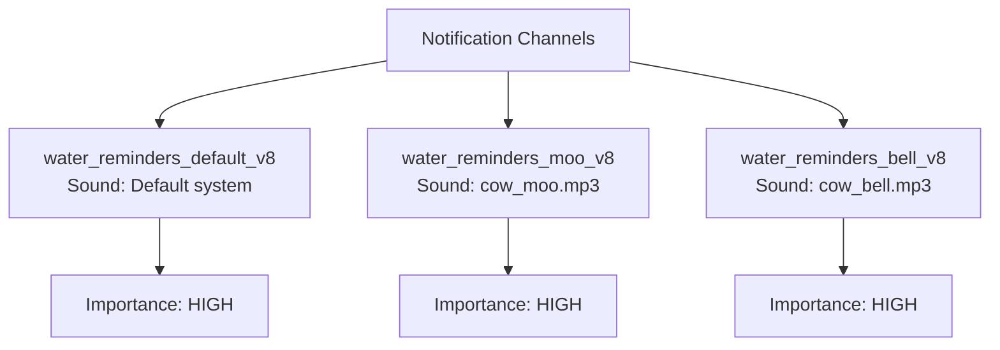

# Notifications

Water Cow uses `expo-notifications` to schedule local notifications on Android. No server or push notification service is involved.

## Permissions

Android 13+ (API 33) requires runtime permission for notifications. The app requests this using:

```typescript
const { status } = await Notifications.requestPermissionsAsync();
```

If the user denies permission, reminders still get scheduled but won't display. The app should check and prompt the user.

## Notification Channels

Since Android 8 (API 26), every notification must belong to a **notification channel**. Channels control the notification's sound, vibration, and importance.

Water Cow creates channels using a **native module** (`WaterCowNotificationModule.kt`), not through `expo-notifications`, because custom sound file references require native Android resource URIs.

### Channel Structure



### Creating Channels (Native Side)

In `WaterCowNotificationModule.kt`:

```kotlin
@ReactMethod
fun createNotificationChannel(channelId: String, channelName: String, soundFileName: String?) {
    val channel = NotificationChannel(channelId, channelName, NotificationManager.IMPORTANCE_HIGH)

    if (soundFileName != null) {
        // Reference sound from res/raw/ directory
        val soundUri = Uri.parse(
            "android.resource://${context.packageName}/raw/$soundFileName"
        )
        channel.setSound(soundUri, AudioAttributes.Builder()
            .setUsage(AudioAttributes.USAGE_NOTIFICATION)
            .setContentType(AudioAttributes.CONTENT_TYPE_SONIFICATION)
            .build())
    }

    notificationManager.createNotificationChannel(channel)
}
```

### Scheduling Notifications (JS Side)

In `utils/notifications.ts`:

```typescript
await Notifications.scheduleNotificationAsync({
  content: {
    title: '💧 Water Cow Reminder',
    body: 'Time to drink some water! 🐄',
    sound: false, // Sound comes from the CHANNEL, not the notification
  },
  trigger: {
    type: 'daily',
    hour: 10,
    minute: 0,
    channelId: 'water_reminders_moo_v8', // Routes to the correct channel
  },
});
```

:::warning Sound is Channel-Level
On Android, the **channel** controls the sound, not the individual notification. Setting `sound` on the notification content does nothing if a channel is used. This is an Android platform behavior, not a bug.
:::

## Sound Files

Custom sounds must be in Android's `res/raw/` directory as native resources. The build process copies them automatically:

```
assets/sounds/cow_moo.mp3  →  android/app/src/main/res/raw/cow_moo.mp3
assets/sounds/cow_bell.mp3 →  android/app/src/main/res/raw/cow_bell.mp3
```

This copy happens via a custom Gradle task in `android/app/build.gradle`:

```groovy
task copyCustomSounds(type: Copy) {
    from '../../assets/sounds/'
    into 'src/main/res/raw/'
    include '*.mp3'
}
preBuild.dependsOn copyCustomSounds
```

## Notification Content

The notification includes:
- **Title**: "💧 Water Cow Reminder"
- **Body**: Varies by cow mood ("Time to drink some water! 🐄")
- **Sound**: Based on the active channel
- **Vibration**: Configurable in reminder settings

## Platform Limitations

1. **Expo Go doesn't support custom sounds** — Must use a dev build or production build
2. **Channels are immutable** — Once created, you cannot change a channel's sound (see [Notification Sounds](/docs/features/notification-sounds))
3. **Background scheduling limits** — Android may delay notifications during Doze mode
4. **No server-side notifications** — Everything is local
