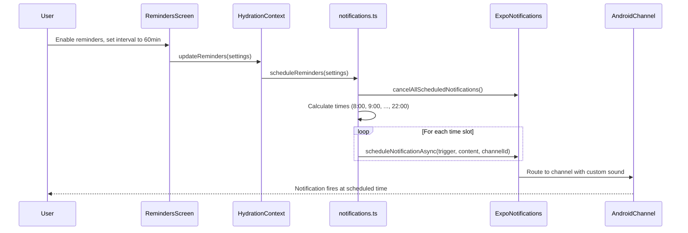

# Reminders

Water Cow sends periodic notifications reminding the user to drink water.

## Settings

All reminder settings are stored in `ReminderSettings`:

```typescript
interface ReminderSettings {
  enabled: boolean;         // Master toggle
  intervalMinutes: number;  // Minutes between reminders (30, 60, 90, 120)
  startHour: number;        // Start of reminder window (e.g., 8 for 8:00 AM)
  startMinute: number;      // Minutes component of start time
  endHour: number;          // End of reminder window (e.g., 22 for 10:00 PM)
  endMinute: number;        // Minutes component of end time
  sound: NotificationSound; // "default" | "cow_moo" | "cow_bell"
  vibrate: boolean;         // Whether to vibrate with notification
}
```

## How Reminders Are Scheduled

When the user enables reminders, the app:
1. Cancels all existing scheduled notifications
2. Calculates notification times based on interval, start time, and end time
3. Schedules each notification using `expo-notifications`



## Interval Options

| Interval | Number of Daily Reminders (8AM–10PM) |
|----------|--------------------------------------|
| 30 min | ~28 |
| 60 min | ~14 |
| 90 min | ~9 |
| 120 min | ~7 |

## Notification Channel Assignment

Each sound option maps to a specific Android notification channel:

| Sound Setting | Channel ID |
|--------------|------------|
| `"default"` | `water_reminders_default_v8` |
| `"cow_moo"` | `water_reminders_moo_v8` |
| `"cow_bell"` | `water_reminders_bell_v8` |

The `v8` suffix is the channel version. See [Notification Sounds](/docs/features/notification-sounds) for why this versioning exists.

## Test Notification

The reminders screen has a "Test" button that sends an immediate notification:

```typescript
await Notifications.scheduleNotificationAsync({
  content: {
    title: '💧 Water Cow Reminder',
    body: 'Time to drink some water!',
    sound: getNotificationSoundFile(settings.sound),
  },
  trigger: null, // null = send immediately
});
```

## Reminder Window

Reminders only fire within the configured time window:
- **Start time**: Default 8:00 AM
- **End time**: Default 10:00 PM

Notifications outside this window are not scheduled, so the app won't wake you up at night.
