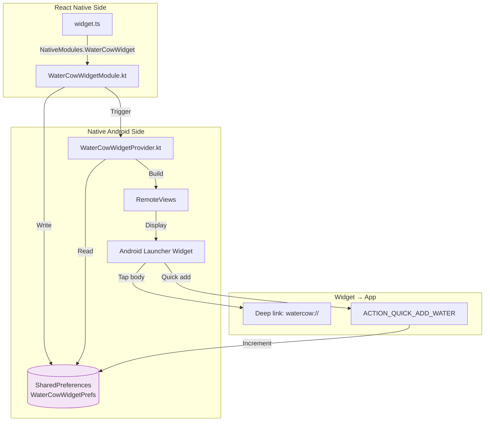
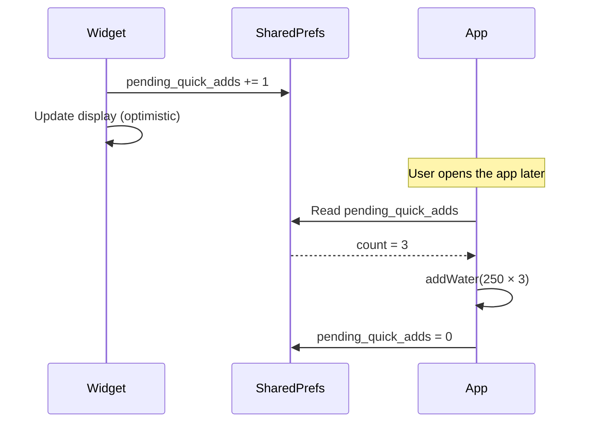

# Android Home Screen Widget

Water Cow includes a native Android home screen widget that shows live hydration progress.

## Why Native?

React Native **cannot** render Android home screen widgets. Widgets use `RemoteViews`, a restricted subset of Android views that runs in the launcher's process, outside the app's activity. This requires native Kotlin code.

## Architecture



## Files Involved

| File | Purpose |
|------|---------|
| `utils/widget.ts` | JS-side bridge — calls `NativeModules.WaterCowWidget` |
| `WaterCowWidgetModule.kt` | Native module — updates SharedPreferences, triggers widget refresh |
| `WaterCowWidgetHelper.kt` | SharedPreferences helper — constants and read/write methods |
| `WaterCowWidgetProvider.kt` | `AppWidgetProvider` — builds and updates `RemoteViews` |
| `WaterCowWidgetPackage.kt` | `ReactPackage` — registers the native module with React Native |
| `res/layout/watercow_widget.xml` | Widget XML layout (RelativeLayout) |
| `res/layout/widget_preview.xml` | Widget picker preview layout |
| `res/xml/watercow_widget_info.xml` | Widget metadata (size, update period) |
| `res/drawable/widget_bg.xml` | Widget background (rounded gradient) |
| `res/drawable/widget_progress_bar.xml` | Widget progress bar style |

## Widget Layout

The widget displays:
- **Title**: "Water Cow 🐄"
- **Date**: "Today"
- **Liters consumed**: Large text (e.g., "1.5 L")
- **Goal subtitle**: "of 2.0 L Goal (75%)"
- **Progress bar**: Horizontal progress bar

Layout defined in `res/layout/watercow_widget.xml` using `RelativeLayout`.

### Widget Size

Configured in `res/xml/watercow_widget_info.xml`:

| Property | Value | Meaning |
|----------|-------|---------|
| `minWidth` | 180dp | Minimum 3 cells wide |
| `minHeight` | 80dp | Minimum 2 cells tall |
| `targetCellWidth` | 3 | Preferred 3 cells wide |
| `targetCellHeight` | 2 | Preferred 2 cells tall |
| `resizeMode` | horizontal\|vertical | User can resize |
| `updatePeriodMillis` | 1800000 | System updates every 30 minutes |

## Data Sync (App → Widget)

When water is added in the app:

```typescript
// utils/widget.ts
export async function updateNativeWidget(consumedMl: number, goalMl: number) {
  const WaterCowWidget = NativeModules.WaterCowWidget;
  if (WaterCowWidget) {
    await WaterCowWidget.updateWidget(consumedMl, goalMl);
  }
}
```

The native module writes to SharedPreferences and triggers a widget update:

```kotlin
// WaterCowWidgetModule.kt
@ReactMethod
fun updateWidget(consumedMl: Int, goalMl: Int) {
    val prefs = context.getSharedPreferences("WaterCowWidgetPrefs", Context.MODE_PRIVATE)
    prefs.edit()
        .putInt("consumed_ml", consumedMl)
        .putInt("goal_ml", goalMl)
        .putString("date_key", todayDateKey())
        .apply()

    // Trigger widget refresh
    updateAllWidgets(context)
}
```

## Quick Add (Widget → App)

Users can add 250ml directly from the widget:

1. Widget button triggers `ACTION_QUICK_ADD_WATER` broadcast
2. `WaterCowWidgetProvider.onReceive()` handles the action
3. Increments `pending_quick_adds` in SharedPreferences
4. Updates the widget UI immediately (optimistic update)
5. When the app opens, `checkAndSyncWidgetQuickAdds()` reads the count
6. Adds the water entries and resets the count



## AndroidManifest Registration

The widget is registered in `AndroidManifest.xml`:

```xml
<receiver
    android:name=".WaterCowWidgetProvider"
    android:exported="true">
    <intent-filter>
        <action android:name="android.appwidget.action.APPWIDGET_UPDATE"/>
        <action android:name="com.watercow.app.ACTION_QUICK_ADD_WATER"/>
    </intent-filter>
    <meta-data
        android:name="android.appwidget.provider"
        android:resource="@xml/watercow_widget_info"/>
</receiver>
```

## Adding the Widget to Home Screen

1. Long-press on the Android home screen
2. Select "Widgets"
3. Search for "Water Cow"
4. Drag the widget to the home screen
5. Open the Water Cow app at least once to sync data

:::warning First Launch Required
The widget shows "0.0 L / 2.0 L" until the app has been opened at least once. This is because SharedPreferences are empty until the app writes to them.
:::
